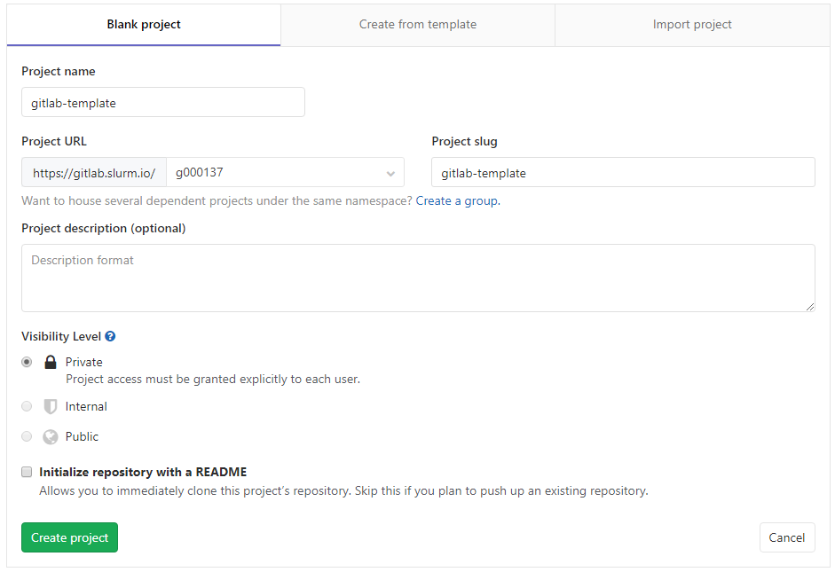

### Шаблоны в gitlab ci/cd

Если у вас микросервисная архитектура или много однотипных проектов, удобно сделать универсальный шаблон ci/cd. Для этого в gitlab есть возможность подключать yml как локальные, так и из удаленных репозиториев. Для этого используется секция include.

### Подготовка

* Создаем новый проект: gitlab-template
 
Переходим на главную страницу [gitlab](https://gitlab.slurm.io/) и выбираем `New Project`, справа вверху. 
 
`Project Name` - gitlab-template.
`Project Url` - GROUP-NAME, необходимо выбрать имя своей группы.
 


И нажимаем `Create project`

* Клонируем проект на sandbox

```bash
git clone git@gitlab.slurm.io:GROUP-NAME/gitlab-template.git
cd gitlab-template
```

`GROUP-NAME` необходимо заменить на имя своей группы.

### Создание шаблона

* Создание шаблона со stages

```bash
cat << EOF > stages_tmpl.yml
stages:
    - test
    - deploy
    - rollback

workflow:
  rules:
    - if: \$CI_MERGE_REQUEST_IID
    - if: \$CI_COMMIT_BRANCH == "master"

EOF
```


В данном шаблоне описаны возможные stages и он может быть подключен как есть.

* Создание шаблона с тестами

```bash
cat << EOF > test_tmpl.yml
Auto test:
    stage: test
    tags: [slurm-cicd-demo]
    script:
      - docker-compose up --abort-on-container-exit --exit-code-from app
    rules:
      - if: \$CI_MERGE_REQUEST_IID
      - if: \$CI_COMMIT_BRANCH == "master"
      - when: never

EOF
```

В результате подключения данного шаблона будет выполняться задача с автоматизированными тестами.

* Создание шаблона с deploy

```bash
cat << EOF > deploy_tmpl.yml
.deploy:
  stage: deploy
  script:
    - cat \$env > .env
    - cap production deploy
  rules:
    - if: \$CI_COMMIT_BRANCH == "master"
    - when: never

.rollback:
  stage: rollback
  script:
    - cat \$env > .env
    - cap production deploy:rollback
  rules:
    - if: \$CI_COMMIT_BRANCH == "master"
      when: manual
    - when: never

EOF
```
* Пушим изменения

```bash
git add -A
git commit -m "Add first template"
git push -u origin master
```

### Подключение шаблона

В своем форке репозитория xpaste необходимо заменить содержимое файла `.gitlab-ci.yml` на, отредактировав его в gitlab IDE:

```yaml
include:
  - project: 'GROUP-NAME/gitlab-template'
    ref: master
    file: 'stages_tmpl.yml'

  - project: 'GROUP-NAME/gitlab-template'
    ref: master
    file: 'test_tmpl.yml'

  - project: 'GROUP-NAME/gitlab-template'
    ref: master
    file: 'deploy_tmpl.yml'

Deploy app to production:
  tags: [slurm-cicd-demo]
  extends: .deploy

Rollback app on production:
  tags: [slurm-cicd-demo]
  extends: .rollback

```

В результате мы получим аналогичный прошлому шагу ci/cd. 

Удалить Sandbox
