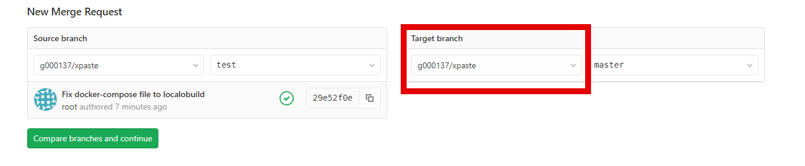
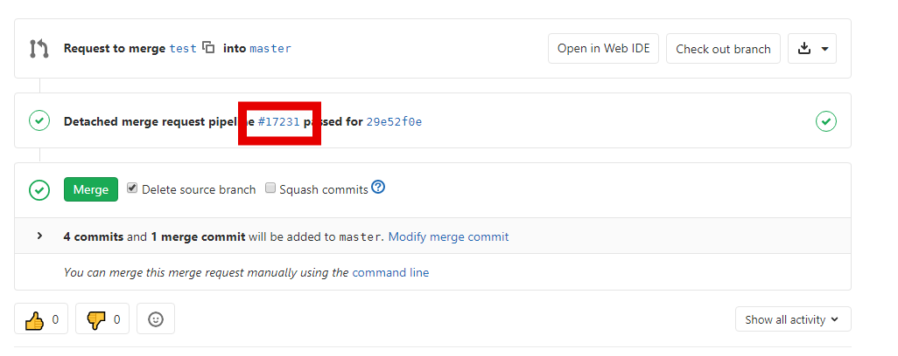

# Pipeline

[[_TOC_]]

Pipeline (конвеер, пайплайн) описывается в файле **gitlab_ci.yml**

+ `stages` - список стадий (этапов) для данного конвеера;
+ `variables` - список глобальных переменных;
+ `<job>` - описание задания;
  + `after_script` - команды, которые выполняются после задания вне зависимости
от результата `script` (кода выхода);
  + `allow_failure` - продолжать ли выполнение конвеера в случае ненулевого кода возврата
в `script`
  + `artifact` - список артефактов, которые образовались в результате выполнения
задания и должны быть переданы в следующую стадию;
  + `before_script` - команды, которые выполняются перед стартом задания;
  + `cache` - настройки кэширования;
  + `dependencies` - список заданий, артефакты из которых должны быть получены в текущем
задании;
  + `rules` - список правил, определяющих, создавать ли задание; представляет собой
_yaml list,_ состоящий из набора операторов;
    - `if` - позволяет сравнивать переменные;
    - `changes` - позволяет выполнять задание только при изменении определенных файлов
в коммите/MR;
    - `when` - условия запуска задания (см. ниже);
  + `script` - список команд, которые выполняются в данном задании;
  + `stage` - стадия, на которой выполняется данное задание;
  + `tags` - список тэгов для выбора gitlab-runner для выполнения задания;
  + `variables` - список переменных, локальных для текущего задания;
  + `when` - выбор способа запуска задания:
    + `on_success` - при успешном выполнении всех заданий предыдущей стадии;
    + `on_failure` - при неуспешном выполнении предыдущей стадии (по крайней мере одно
задание завершилось с ошибкой);
    + `always` - выполнять независимо от результата предыдущей стадии;
    + `manual` - ручной запуск задания.

_Подробное руководство по синтаксису .gitlab-ci.yml можно найти в
[документации](https://docs.gitlab.com/ee/ci/yaml/)_

## Настройка GitLab CI/CD

### Создание переменных

+ Сгенерировать удобным вам образом (или придумать) **3 пароля**.
Можно использовать `pwgen`, имеющийся на devbox:
```sh
pwgen 12 3
```
+ открыть в браузере **свой форк** проекта xpaste, перейти в настройки переменных: **Settings -> CI/CD -> Variables**,
и добавить следующие переменные:
```yaml
PG_DB_USER: xpaste_prod
PG_DB_PASSWORD: <password_1>
POSTGRES_PASSWORD: <password_2>
SECRET_KEY_BASE: <password_3>
```
### Создание конфигурационного файла Gitlab CI

+ Перейти в каталог с клоном форка xpaste;
  + представиться системе контроля версий (если ещё не сделано);
+ создать новую ветку;
+ скопировать конфигурационный файл из бэкапа;
+ добавить его в staging area;
+ закоммитить;
+ запушить:
```sh
cd ~/xpaste
git config --global user.email "YOUR@EMAIL.TLD"
git config --global user.name "Your Name or Student Number"
git checkout -b feature/ci
cp -v .gitlab-ci.yml.docker.bak .gitlab-ci.yml
git add .gitlab-ci.yml
git commit -m 'Add CI file'
git push origin feature/ci
```

### Создание Merge Request (запроса на слияние)

+ В выводе предыдущей команды будет длинная такая ссылка -- надо скопировать её в адресную строку браузера и перейти;
+ сверху нажать **Change branches** и выбрать в качестве _Target branch_ g000<YOUR_ID>/xpaste | master;
+ нажать **Compare branches and continue**;
+ нажать **Submit merge request**, затем посмотреть на созданный pipeline;
+ расстроиться, исправить ошибки в Dockerfile, запушить снова;
+ после успешного завершения pipeine принять MR (нажать кнопку **[Merge]**); посмотреть на созданный pipeline;
+ после завершения pipeline пойти браузером на **xpaste_server_IP** (взять в уведомлениях - например,
https://edu.slurm.io/notifications), и посмотреть на приложение.

<!--
Переходим на страницу форка проекта xpaste: https://gitlab.slurm.io/GROUP-NAME/xpaste/merge_requests
(`GROUP-NAME` необходимо заменить на имя своей группы.) и нажимаем кнопку в правом верхнем углу:
`Create merge request`. В качестве `Source branch` выбираем g<номер студента> и ветку test,
в `Target branch` выбираем форк нашего репозитория и ветку master.



После этого нажимаем `Compare branches and continue`. Заполняем `Title` и `Description` и нажимаем `Submit`.

В итоге мы получим MR. На данной странице отображаются данные по изменениям в MR, описание данного MR,
а также статус pipeline для данного MR.


-->

<!--
В результате будет создано два pipeline:

* С тестами приложения, которое запустилось при создании MR.
* Для деплоя приложения. Данный pipeline содержит 2 job:
  * Деплой приложения - запускается автоматически
  * Откат приложения - запускается в ручном режиме
-->

### Rollback

Попробуем сломать что-то в приложении, но так, чтобы оно прошло тесты и доехало до прода.
Например, изменить надпись "New Paste" ("Новая заметка").
Для ускорения процесса работаем прямо в master:
```sh
git checkout master
git pull
```
+ Отредактировать файл с сообщениями; выберите нужный, в зависимости от вашей локали:
  + **config/locales/en.yml**
  + **config/locales/ru.yml**
+ заменить строку в позиции `pastes.new.title` ("New Paste" или "Новая заметка") на что-нибудь другое, например "Happy New Year 2021!"
```sh
git add config/locales
git commit -m 'Bad message'
git push origin master
```
+ после завершения деплоя убедиться (в браузере), что приветствие посередине страницы заменилось на "Happy New Year 2021!";
+ вручную запустить последний stage в последнем pipeline;
+ после завершения задания убедиться, что приветствие приобрело прежний вид.

**Далее:** [3. Шаблоны GitLab CI/CD](gitlab-ci-include.md)
