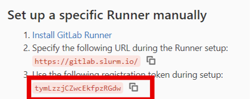
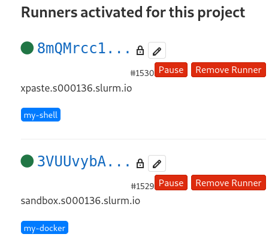

# Начало работы с gitlab-runner

[[_TOC_]]

## Установка Docker

<!--
+ Установить необходимые пакеты

```sh
yum -y install device-mapper-persistent-data lvm2
```
-->

<b>sandbox ~$ _</b>

* Установить репозиторий docker и сам docker
```sh
sudo yum -y install yum-utils
sudo yum-config-manager --add-repo https://download.docker.com/linux/centos/docker-ce.repo
sudo yum -y install docker-ce docker-compose
```
+ Включить и запустить сервис
```sh
sudo systemctl enable --now docker
```
+ Добавить себя в группу docker и проверить доступ к API
```sh
sudo usermod `whoami` -aG docker
newgrp docker
docker info
```

## Установка Gitlab Runner

* Установить репозиторий gitlab-runner
```sh
cat << 'EOF' | sudo tee /etc/yum.repos.d/runner_gitlab-runner.repo
[runner_gitlab-runner]
name=runner_gitlab-runner
baseurl=https://packages.gitlab.com/runner/gitlab-runner/el/7/$basearch
repo_gpgcheck=1
gpgcheck=1
enabled=1
gpgkey=https://packages.gitlab.com/runner/gitlab-runner/gpgkey
       https://packages.gitlab.com/runner/gitlab-runner/gpgkey/runner-gitlab-runner-366915F31B487241.pub.gpg
sslverify=1
sslcacert=/etc/pki/tls/certs/ca-bundle.crt
metadata_expire=300
EOF
```
_source: https://packages.gitlab.com/runner/gitlab-runner/install#manual-rpm_
* Установить gitlab-runner
```sh
sudo yum -y install gitlab-runner
```

## Регистрация gitlab-runner

Открыть в браузере **свой форк** проекта xpaste и перейти в настройки: **Settings -> CI/CD -> Runners**,
секция **Set up a specific Runner manually**.



Выполнить команду
```sh
sudo gitlab-runner register --docker-privileged --docker-volumes '/var/run/docker.sock:/var/run/docker.sock'
```
и ввести требуемые параметры:

+ **Сoordinator URL:** п.2 (Specify the following URL during the Runner setup)
+ **gitlab-ci token:** п.3 (Use the following registration token during setup)
+ **description:** (оставляем как есть)
+ **gitlab-ci tags:** my-docker
+ **Executors:** docker
  + **default Docker image:** docker:latest

## Установка docker и gitlab-runner на xpaste

<b>xpaste ~$ _</b>

Выполнить те же действия (установку docker, установку и регистрацию раннера) на хосте **xpaste**,
но с некоторыми отличиями:

- команду регистрации раннера выполнить без докерных параметров:
```sh
sudo gitlab-runner register
```
  - **gitlab-ci tags:** my-shell
  - **Executors:** shell
+ добавить пользователя gitlab-runner в системную группу docker:
```sh
sudo usermod gitlab-runner -aG docker
```
+ установить пакет **python36-virtualenv**:
```sh
sudo yum -y install python36-virtualenv
```

<!--
_Один gitlab-runner можно зарегистрировать несколько раз с разным набором параметров._
-->

### Проверка регистрации gitlab-runner

В разделе **Runners** должны отображаться оба ваших runner'а:



## Изменения настроек

После установки настройки gitlab-runner могут быть изменены. Для этого необходимо внести изменения в конфигурационный файл: `/etc/gitlab-runner/config.toml`.

В конфигурации gitlab-runner есть одна не очевидная, но очень полезная настройка: глобальная `concurrent` и `limit` на уровне runner. 

* `concurrent` - задает глобальный лимит на количество job, которые могут выполнять все runner.
* `limit` - задает лимит на количество job, которые может выполнять runner.

За счет комбинации этих настроек, например, возможно ограничить количество паралельно запускаемых тяжелых сборок и гарантировать ресурсы для маленьких и легких сборок.

На раннере xpaste увеличим кол-во одновременно запускаемых заданий до 2:
```sh
VISUAL=vim sudoedit /etc/gitlab-runner/config.toml
# Change concurrent = 2
sudo systemctl restart gitlab-runner.service
```

<!--
## Метрики

gitlab-runner имеет встроенную поддержку prometheus. 

* Добаляем экспозицию метрик в конфигурацию gitlab-runner

```bash
sed -i '1 i\listen_address="0.0.0.0:9252"' /etc/gitlab-runner/config.toml
```

Эта команда запишет необходимую настройку в конфигурационный файл gitlab-runner. 

* Применяем настройки для gitlab-runner

```bash
systemctl restart gitlab-runner
```

* Проверяем доступность метрик

Метрики доступны по адресу: http://<SANDBOX_IP>:9252/metrics. Где `SANDBOX_IP` внешний адрес вашего sandbox сервера.
-->

## Полезные ссылки

Полный список параметров для настройки доступен в [документации](https://docs.gitlab.com/runner/configuration/advanced-configuration.html)

----

**Далее:** [2. Настройка GitLab CI/CD](gitlab-ci.md)
