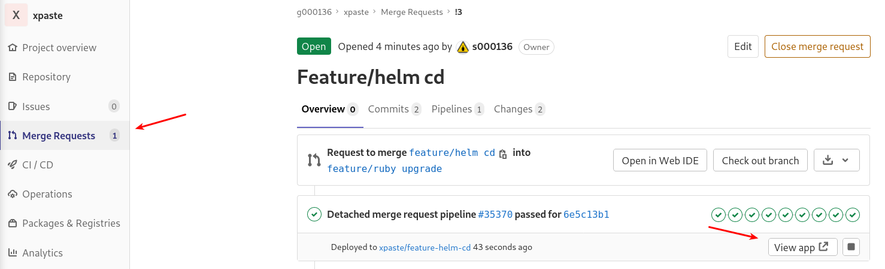
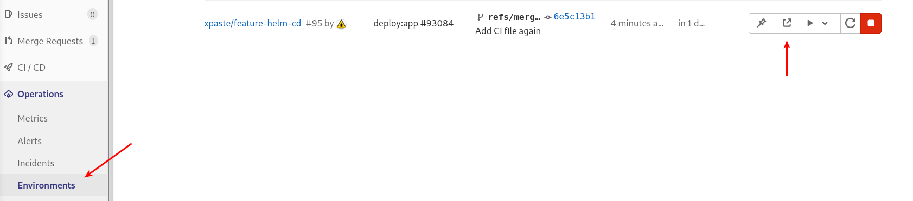

# Настройка CD в Kubernetes через Helm

+ Удалить свой форк xpaste, оставшийся с прошлой практики;
+ сделать новый форк проекта https://gitlab.slurm.io/tinkoff/xpaste в свою группу;
+ создать переменные GitLab:
  + `PG_DB_PASSWORD`: какой-нибудь пароль (например, сгенерировать `pwgen 16 1`) -- можно сделать "masked";
  + `SECRET_KEY_BASE`: то же самое;
  + `K8S_API_URL`: взять из вывода `kubectl cluster-info`;
  + `K8S_CI_TOKEN`: получить в нашем сетапе можно следующей командой:
    ```sh
    kubectl -n op-dynns-xpaste get -o jsonpath='{ .data.token }' secret dynns-cr-sa-token-<TAB> | base64 -d; echo
    ```
+ _выполнить действия, специфичные для используемого оператора:_
  + _API token:_
    + создать токен для доступа к API: **Settings -> Access Tokens**, **Name:** `dynns`, **Scopes:** api;
    + зашифровать токен:
      ```sh
      ansible-vault encrypt_string --vault-password-file .vault_pass --name _dynns_gitlab_api_token "<YOUR_GITLAB_API_TOKEN>" | base64 -w0; echo
      ```
    + создать переменную GitLab с именем `CR_GITLAB_API_TOKEN_ENCRYPTED` и значением, полученным на предыдущем шаге;
  + _Registry access token:_
    + создать токен для доступа к registry (мы получали такой же при деплое
оператора): **Settings -> Repository -> Deploy Tokens**, **Name:** `gitlab-deploy-token`, Scopes: read_registry, write_registry
    + зашифровать полученный токен:
      ```sh
      ansible-vault encrypt_string --vault-password-file .vault_pass --name _dynns_registry_pass "<DOCKER_REGISTRY_TOKEN>" | base64 -w0; echo
      ```
    + создать переменную GitLab с именем `CR_DEPLOY_USER` и значением из поля "Use this username as a login", полученным при генерации токена;
    + создать переменную GitLab с именем `CR_DEPLOY_PASSWORD_ENCRYPTED` и значением, полученным на предыдущем шаге;
+ склонировать свой форк проекта xpaste (если у вас осталась рабочая копия с предыдущих практик -- удалите её);
+ создать feature-ветку и скопировать из образца файл **.gitlab-ci.yml**:
  ```sh
  cd ~/xpaste
  git checkout -b feature/helm_cd
  cp -v .gitlab-ci.yml.helm.bak .gitlab-ci.yml
  ```
+ add, commit, push;
+ создайте **merge request** в свой master.

## Helm wait/atomic

Дождавшись завершения pipeline (> 10m; скорее всего -- успешного; в противном случае обратитесь к техподдержке), перейдите по ссылке на ревью-окружение


----

**или**



 :warning: Для предотвращения редиректа воспользуйтесь Privacy Mode в браузере (на домене висит HSTS, а сертификата нет).

_Видим 503. При этом pipeline завершился успешно. Непорядок._

### Task I

Внести правку в **.gitlab-ci.yml**, чтобы helm завершался с ошибкой в случае неудачного деплоя.

<p>
<details>
<summary>Спойлер.</summary>
Добавить в команду деплоя
<pre><code>--wait</code></pre>
или
<pre><code>--atomic</code></pre>
, чтобы <em>helm</em> подождал, пока задеплоенные сущности поднимутся или, в противном случае, упал по таймауту (по умолчанию -- 5m)
<pre><code>--timeout 40s</code></pre>
</details>
</p>

_Отлично, теперь оно падает. Впрочем -- непонятно, почему._

<!-- Снести неудачный Helm release:
```sh
helm3 -n <YOUR_XPASTE_REVIEW_NAMESPACE> uninstall g000136-xpaste
```
-->

----

**Далее:** [14.3 Краткая диагностика через Helm hooks](helm-hook.md)

