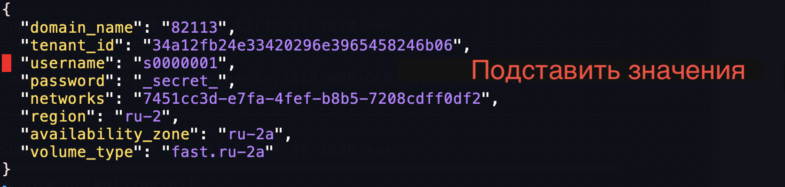
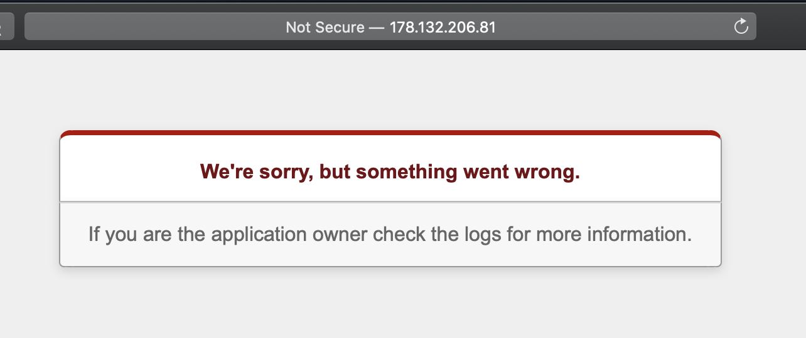
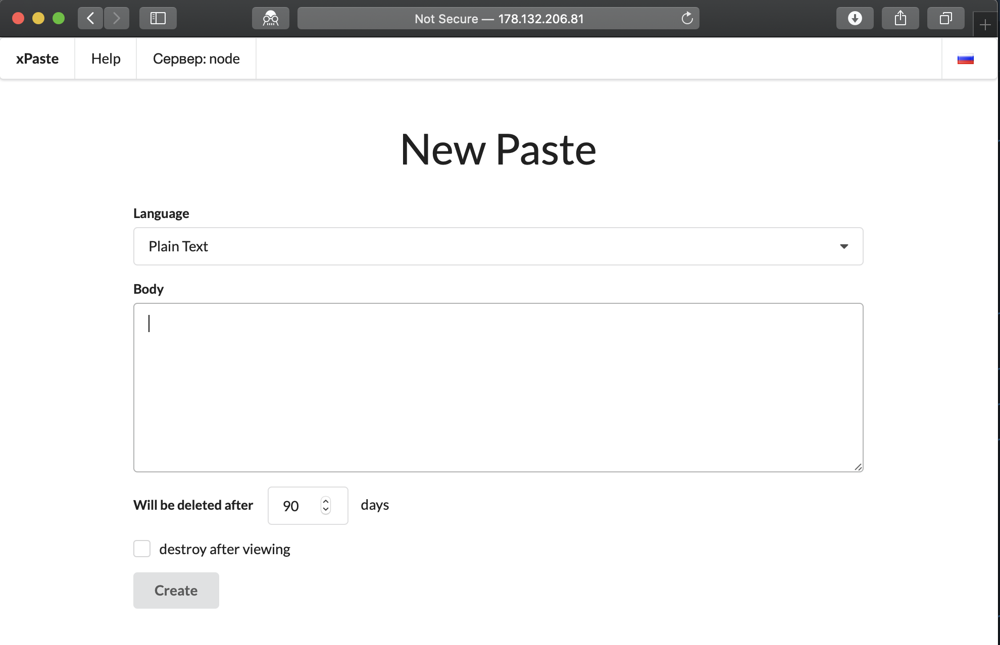

# Работа с Packer

**Цель:** Создать два образа (БД и приложение) и на их основе запустить VDS с помощью нашего модуля.

[[_TOC_]]

Packer создаёт вычислительные ресурсы для своей работы на стороне хостера, за исключением сети.
Для начала работы нужно создать сеть.

## Создание сети

**~/slurm/practice/15.iac_terraform/tf_base $**

+ **main.tf**
  + удалить вызов нашего модуля `module "vm_1" { ... }`
+ **outputs.tf**
  + раскомментировать вызов `output "network_id" { ... }`
  + закомментировать всё остальное (`output "server_internal_ips" { ... }`)
+ запустить terraform
  ```sh
  terraform apply -var-file=secrets.tfvars
  ``` 
  в результате мы должны получить UUID нашей сети
  ```
  Apply complete! Resources: 7 added, 0 changed, 0 destroyed.

  Outputs:

  network_id = 7451cc3d-e7fa-4fef-b8b5-7208cdff0df2
  ```
  этот UUID пригодится в следующем шаге

## Запекание образов ВМ

+ Заполнить файл с параметрами (в т.ч. подставить полученный ранее UUID)
  ```sh
  cd ~/slurm/practice/15.iac_terraform/packer
  cp -iv vars.json.example vars.json
  vim vars.json
  ```
  
+ вставить в файл **packer.json** на место плейсхолдера `XPASTE_PATH` полный путь
своего склонированного репозитория xpaste (например, **/home/00/01/s000136/xpaste**)
+ провалидировать конфигурацию и "запечь" образы с приложением и базой данных
  ```sh
  packer validate -var-file=vars.json packer.json
  packer build -parallel=false -var-file=vars.json packer.json
  ```
  Процесс занимает несколько минут, в это время можно изучить структуру текущего каталога;
по завершении процесса мы должны увидеть подобное сообщение:
  ```sh
  ==> Builds finished. The artifacts of successful builds are:
  --> app: An image was created: dc886005-c217-4e4a-bed1-84c4d7850011
  --> db: An image was created: 7540628b-921f-4920-9218-69ca2cb51bb4
  ```
  Полученные UUID образов нам потребуются на следующем шаге.

Теперь надо из этих образов запустить виртуальные машины. 

## Конфигурация Terraform

### Редактирование модуля

Добавим в наш модуль (тот самый, который мы пушили в GitLab) инструкции,
необходимые для работы приложения.

+ Перейти в каталог с модулем
  ```sh
  cd ~/slurm/practice/15.iac_terraform/tf_base/module_openstack_vm
  ```
+ поскольку наше приложение подключается к базе по статическому IP, требуется
добавить инструкцию для явного указания этого IP (**main.tf**)
  ```diff
  ###################################
  # Create port
  ###################################
  resource "openstack_networking_port_v2" "port_1" {
    name       = "node-eth0"
    network_id = var.network_id

    fixed_ip {
      subnet_id = var.subnet_id
  +    ip_address   = var.fixed_ip
    }
  }
  ```
  + и добавить эту переменную в **vars.tf**
    ```diff
    +variable "fixed_ip" {}
    ```
+ также нужно организовать публичный IP-адрес для нашего VDS; Floating IP
навешивается на порт, и нам надо переменную `openstack_networking_port_v2`
передать из модуля в главный тред, т.е. добавить в **outputs.tf** вывод необходимого значения
  ```terraform
  output "app_port_id" {
    value = openstack_networking_port_v2.port_1.*.id
  }
  ```
+ git add, commit, push

### Создание ВМ

+ Перейти в каталог с конфигурацией Terraform
  ```sh
  cd ~/slurm/practice/15.iac_terraform/tf_base
  ```
+ по аналогии с прошлым заданием в файле **main.tf** создать две ВМ (не забыть подставить
свою группу вместо `g000000`)
  ```terraform
  module "vm_db" {
    source      = "git::ssh://git@gitlab.slurm.io/g000000/module_openstack_vm.git?ref=master"
    network_id  = openstack_networking_network_v2.network_1.id
    subnet_id   = openstack_networking_subnet_v2.subnet_1.id
    vm_count    = var.vm_count

    image_id    = # указать UUID для DB и APP соответcтвенно и не забыть про кавычки
    volume_type = var.volume_type
    az_zone     = var.az_zone
    flavor_id   = openstack_compute_flavor_v2.flavor-node.id
    key_pair_id = openstack_compute_keypair_v2.terraform_key.id
    fixed_ip    = "192.168.0.NNN" # 100 для DB, 101 для app.
  }

  module "vm_app" {
    ...
  }
  ```
+ там же в **main.tf** создать публичный Floating IP
  ```terraform
  ###################################
  # Create floating IP
  ###################################
  resource "openstack_networking_floatingip_v2" "floatingip_1" {
    pool = "external-network"
  }

  ###################################
  # Link floating IP to internal IP
  ###################################
  resource "openstack_networking_floatingip_associate_v2" "association_1" {
    port_id     = module.vm_app.app_port_id[0]  # переменная из модуля -- в нашем примере app_port_id
    floating_ip = openstack_networking_floatingip_v2.floatingip_1.address
  }
  ```
+ раскомментировать в **outputs.tf** вывод этого IP
  ```terraform
  output "server_external_ip" {
    value = openstack_networking_floatingip_v2.floatingip_1.address
  }
  ```
+ запустить Terraform
  ```sh
  terraform get
  terraform apply -var-file=secrets.tfvars
  ```

На выходе получаем IP нашего сервера:
```sh
Apply complete! Resources: 8 added, 0 changed, 0 destroyed.

Outputs:

network_id = 4e12e539-f0dd-4c19-8eb6-be243151d257
server_external_ip = 178.132.206.81
```
Заходим по этому ip и наблюдаем что миграция базы данных еще не прошла:


Через минуту миграция прошла и наше приложение работает:


## Очистка

Уже традиционно, удалить ВМ и прочие ресурсы
```sh
terraform destroy -var-file=secrets.tfvars

```

[Далее: Terraform - приемы](TF_METHODS.md)

