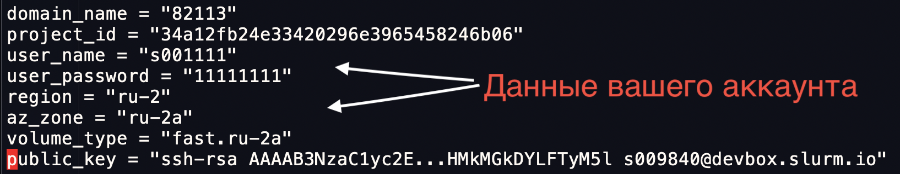
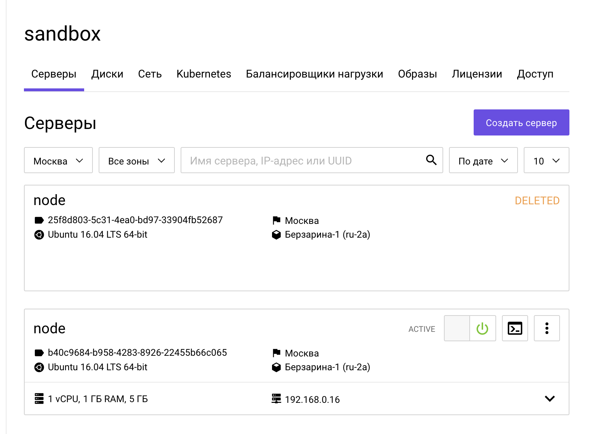

# Основы работы с Terraform

**Цель:** создать тестовую инфраструктуру посредством terraform, познакомиться с модулями.

[[_TOC_]]

## Первый запуск

+ Скопировать и заполнить **secrets.tfvars**
  ```sh
  cd ~/slurm/practice/15.iac_terraform/tf_base
  cp -iv secrets.tfvars.example secrets.tfvars
  vim secrets.tfvars
  ```
  (**public_key** - публичный ключ с devbox `cat ~/.ssh/id_rsa.pub`)
  
+ запустить terraform, по запросу ввести `yes`
  ```sh
  terraform init
  terraform plan -var-file=secrets.tfvars
  terraform apply -var-file=secrets.tfvars
  ```
  В конце будет вывод переменной `server_external_ip`, содержащий IP-адрес созданного сервера;
можно зайти на него по ssh `ssh -l root <server_external_ip>`.
Также сервер будет доступен в панели управления. 

## Задание на понимание структуры объекта "resource"

+ Создать файл **secondary.tf**, скопировать в него из **main.tf** и настроить ресурсы `port`, `volume`, `instance`;
  ```sh
  vim -O main.tf secondary.tf
  ```
+ после создания файла запустить terraform
  ```sh
  terraform apply -var-file=secrets.tfvars
  ```
+ удалить файл и запустить terraform еще раз
  ```sh
  rm secondary.tf
  terraform apply -var-file=secrets.tfvars
  ```

[ :scroll: ](https://gitlab.slurm.io/-/snippets/67)

### Самостоятельная работа

1. Настройте вывод внутреннего адреса сервера по аналогии с переменной `server_external_ip`;
нужную переменную можно подсмотреть в файле **terraform.tfstate** (обратите внимание,
что вывод появится после повторного `terraform apply ...`).
Hint: `openstack_compute_instance_v2._NAME_.access_ip_v4`
1. Параметризуйте значение размера памяти во `flavor`'e и задайте ему
значение по-умолчанию по аналогии с `hdd_size`; затем можно отресайзить ВМ
  ```sh
  TF_VAR_ram=2048 terraform apply -var-file=secrets.tfvars
  ```
1. Избавьтесь от переменной `public_key`; ключ читать напрямую из **~/.ssh/id_rsa.pub**,
используя [функцию file()](https://www.terraform.io/docs/configuration/functions/file.html)

[ :scroll: ](https://gitlab.slurm.io/-/snippets/68)

## Модули

Ресурсы можно вынести в отдельный модуль с целью переиспользования при создании большего количества виртуальных машин.

**~/slurm/practice/15.iac_terraform/tf_base $**

+ Создать каталог **module_openstack_vm** и файлы манифестов модуля
  ```sh
  mkdir module_openstack_vm
  touch module_openstack_vm/{main,vars,outputs}.tf
  ```
+ перенести следующие ресурсы из **main.tf** в **module_openstack_vm/main.tf** (в основном треде **main.tf** их следует удалить)
  - `resource "openstack_networking_port_v2" "port_1"`
  - `resource "openstack_blockstorage_volume_v3" "volume_1"`
  - `resource "openstack_compute_instance_v2" "instance_1"`
+ у модуля другая область видимости переменных, и он может оперировать только с ресурсами, которые сам создает,
либо с переменными, ему доступными; так как у нас отсутствует сеть и другие ресурсы, то мы должны получать их
через аргументы модуля при его вызове; следует заполнить **module_openstack_vm/vars.tf** следующими переменными
  ```terraform
  variable "network_id" {}
  variable "subnet_id" {}
  variable "hdd_size" {
    default = 5
  }
  variable "image_id" {}
  variable "volume_type" {}
  variable "flavor_id" {}
  variable "key_pair_id" {}
  variable "az_zone" {}
  ```
+ теперь следует переименовать обращения к этим ресурсам и переменным (файл **module_openstack_vm/main.tf**)
  ```terraform
  openstack_networking_network_v2.network_1.id		->  var.network_id
  openstack_networking_subnet_v2.subnet_1.id		->  var.subnet_id
  data.openstack_images_image_v2.ubuntu.id		->  var.image_id
  openstack_compute_flavor_v2.flavor-node.id		->  var.flavor_id
  openstack_compute_keypair_v2.terraform_key.id		->  var.key_pair_id
  ```
+ в конец файла **main.tf** следует добавить вызов нового модуля
  ```terraform
  module "vm_1" {
    source = "./module_openstack_vm"

    network_id = openstack_networking_network_v2.network_1.id
    subnet_id= openstack_networking_subnet_v2.subnet_1.id

    image_id = data.openstack_images_image_v2.ubuntu.id
    volume_type = var.volume_type
    az_zone = var.az_zone
    flavor_id = openstack_compute_flavor_v2.flavor-node.id
    key_pair_id = openstack_compute_keypair_v2.terraform_key.id
  }
  ```
+ для простоты закомментировать следующие блоки ресурсов (поменялась область видимости,
и в прежнем виде они работать не будут)
  + **main.tf**
    ```terraform
    # resource "openstack_networking_floatingip_v2" "floatingip_1" { ... }
    # resource "openstack_networking_floatingip_associate_v2" "association_1" { ... }
    ```  
  + **outputs.tf**
    ```terraform
    # output "server_external_ip" { ... }
    # output "server_internal_ip" { ... }
    ```
+ после этого можно запустить терраформ:
  ```sh
  terraform init
  terraform apply -var-file=secrets.tfvars
  ```
  сервер будет пересоздан, т.к. изменился идентификатор объекта instance;
  был `openstack_compute_instance_v2.instance_1`, стал `module.vm_1`
  ```
  Plan: 4 to add, 0 to change, 6 to destroy.
  ```

[ :scroll: ](https://gitlab.slurm.io/-/snippets/69)

### Вторая ВМ из модуля

+ Создать вторую ВМ, вызвав модуль из main.tf повторно
  ```terraform
  module "vm_2" {
    source = "./module_openstack_vm"

    network_id = openstack_networking_network_v2.network_1.id
    subnet_id= openstack_networking_subnet_v2.subnet_1.id

    image_id = data.openstack_images_image_v2.ubuntu.id
    volume_type = var.volume_type
    az_zone = var.az_zone
    flavor_id = openstack_compute_flavor_v2.flavor-node.id
    key_pair_id = openstack_compute_keypair_v2.terraform_key.id
  }
    ```
+ избирательно удалить ресурсы модуля посредством опции `-target`
  ```sh
  terraform destroy -target module.vm_2 -var-file=secrets.tfvars
  ```

<!--  -->

### Самостоятельная работа

**~/slurm/practice/15.iac_terraform/tf_base $**

:warning: Перед выполнением удалить секцию `module "vm_2" {}` из **main.tf**

1. Создать два сервера, используя опцию `count` и модуль `module_openstack_vm`; подробнее
про `count` [в документации](https://www.terraform.io/docs/configuration/resources.html#count-multiple-resource-instances-by-count) (hint:
в модуль передать переменную `count`).
1. Через оператор `output {}` вывести внутренний IP-адрес ВМ (нужно сделать
переменную для output {} внутри модуля;  т.к. мы используем несколько ресурсов с count,
то в выводе ресурсов должна присутствовать звездочка '<b>*</b>').
1. Модуль может быть удаленным; вынести модуль в git-репозиторий (gitlab, github и т.д.) и подключить его
с указанием имени ветки или тега; [документация по module sources](https://www.terraform.io/docs/modules/sources.html#github).

[ :scroll: ](https://gitlab.slurm.io/-/snippets/70)

## Очистка

Удалим созданные объекты, т.к. практику Packer начнём с пустого окружения.
```sh
terraform destroy -var-file=secrets.tfvars
```

[Далее: работа с Packer](PACKER.md)

