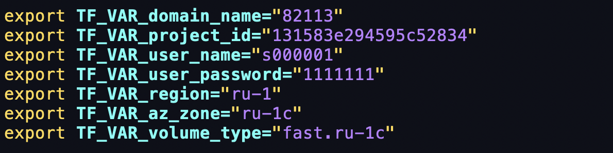
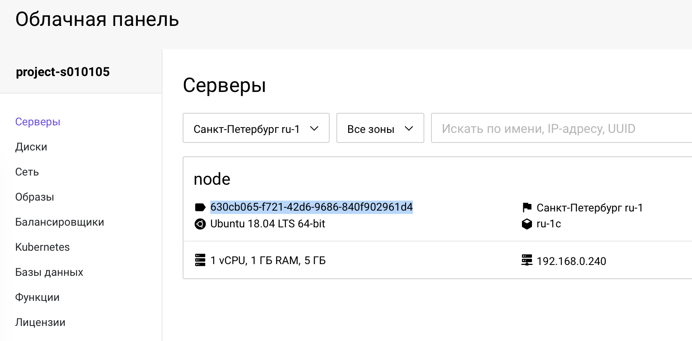

# Terraform Tips and Tricks

**Цель:** Познакомиться с приемами и методами работы с Terraform

[[_TOC_]]

## secret.tfvars

В производственных окружениях файлы **secrets.tfvars**, как правило, не используются.
Необходимые переменные передаются в среду выполнения через CI/СD.

В нашем случае эти переменные выглядели бы примерно так


Для локальной разработки есть вот такая хитрость: можно сделать файл,
который автоматически подгружается terraform'ом
```sh
cd ~/slurm/practice/15.iac_terraform/tf_methods
ln -sv ../tf_base/secrets.tfvars .auto.tfvars
terraform init
terraform plan
```

## Debug

Порой из текста ошибки непонятно, что именно пошло не так.

+ "Испортить" переменную `region`
  ```sh
  vim .auto.tfvars # значение region сделать любое
  terraform apply
  ```
+ наблюдаем ошибку
  ```sh
  Error: Error creating OpenStack image client: No suitable endpoint could be found in the service catalog.
  ```
+ причина сбоя непонятна; чтобы понять суть проблемы, можно повысить подробность вывода terrafrom
  ```sh
  TF_LOG=DEBUG terraform apply
  ``` 
+ проследив выполнение, понятно, что оно падает после выбора региона
  ```sh
  2020-08-16T15:07:34.850+0300 [DEBUG] plugin.terraform-provider-openstack_v1.30.0_x4: 2020/08/16 15:07:34 [DEBUG] Unlocked "auth"
  2020-08-16T15:07:34.850+0300 [DEBUG] plugin.terraform-provider-openstack_v1.30.0_x4: 2020/08/16 15:07:34 [DEBUG] OpenStack Region is: sdfsdf
  Error: Error creating OpenStack image client: No suitable endpoint could be found in the service catalog.
  ```
+ починить значение переменной region в файле **.auto.tfvars** и запустить создание сервера
  ```sh
  terraform apply
  ```
  Сервер создан. 

## State file and import

Как мы уже обсуждали, terraform хранит информацию о созданных объектах в своем state-файле.

+ Cмоделируем ситуацию, будто state-файл terraform был поврежден; для этого следует удалить из него resourse `instance_1`
  ```sh
  vim terraform.tfstate
  ``` 
+ целиком удалить обозначенный ниже json dictionary
  ```json
      {
        "mode": "managed",
        "type": "openstack_compute_instance_v2",
        "name": "instance_1",
        ....
      },
  ```
+ запустить terraform и посмотреть, к чему это привело
  ```sh
  terraform plan
  ```
  Как видно из вывода, terraform собирается создать уже существующую ВМ.
Но есть возможность импортировать уже существующий ресурс. Можно зайти в вашу
облачную панель https://NNNN.selvpc.ru, перейти в раздел с серверами и скопировать UUID ноды:

  

+ подставить этот UUID в команду:
  ```sh
  terraform import openstack_compute_instance_v2.instance_1 630cb065-f721-42d6-9686-840f902961d4
  ```
  В ответ получим
  ```
  Import successful!
  ```
+ проверить статус нашего манифеста:
  ```sh
  terraform apply
  ```
  К сожалению, импорт ресурса `openstack_compute_instance_v2` совсем не совершенен (в отличие, например,
от `vsphere_virtual_machine`) и нам после импорта все равно придется пересоздать инстанс.
 
## Sensitive information

Обратите внимание что после каждого запуска terraform apply в выводе присутствует:
```sh
Outputs:

public_key = <sensitive>
```
Этот вывод описан в файле **outputs.tf**
```terraform
output "public_key" {
  value = openstack_compute_keypair_v2.terraform_key.public_key
  sensitive = true
}
```
Любую выводимую переменную можно обозначить флагом sensitive, и в этом случае она не будет отображаться
на экране после выполнения манифеста. Это может быть полезно для оперирования секретами, но, тем не менее,
все переменные хранятся в state-файле в открытом виде. Посмотреть переменную можно командой
```sh
terraform show
```

## Создание ресурса по условию

Манифесты Terraform описываются на декларативном языке HCL, и декларативная природа описания не позволяет
нам пользоваться той же самой логикой, что и в обычных языках программирования.
У нас нет логического `if` в широком смысле слова, но есть небольшая хитрость.
Используя свойство count, можно создать 0 объектов, также используется тернарный `if` для переменных,
который присуствует в terraform. Можно проверить:

+ Расскоментировать в **main.tf** строку в resource `openstack_compute_instance_v2`
  ```diff
  ###################################
  # Create Instance (VM)
  ###################################
  resource "openstack_compute_instance_v2" "instance_1" {
  +  count = (var.create_server != "" ? 1 : 0)
    name              = "node"
  ```
+ у нас уже есть переменная `create_server` в **vars.tf**, и её значение по умолчанию `true`
  ```sh
  cat vars.tf
  terraform plan
  ```
+ сделать значение переменной "" (пустая строка)
  ```sh
  echo 'create_server=""' >> .auto.tfvars
  terraform plan
  ```
+ убедиться, что terraform собирается удалить наш `instance_1`

## Частый случай использования свойства count

+ В файле vars описывается массив объектов. Предположим, что нам надо создать пользователей в системе;
тогда vars.tf у нас будет выглядеть
  ```terraform
  variable "users" {
    type    = list(string)
    default = ["mike","nicola","john","linux"]
  }
  ```
+ далее описываем ресурс
  ```terraform
  resource "aws_iam_user" "create_users" {
    count=length(var.users)
    name = var.users[count.index]
  }
  ```
+ но есть нюанс! Если удалить одного пользователя посередине списка
  ```terraform
  default = ["mike","john","linux"]
  ```
  то пользователи john и linux пересоздадутся, так как для count терраформ считает уникальность по связке `count.index + name`.

## Remote state

_Демо от преподавателя и обяснение принципов использования remote state._

## Очистка

Удалить серверы и ресурсы
```
terraform destroy

```
